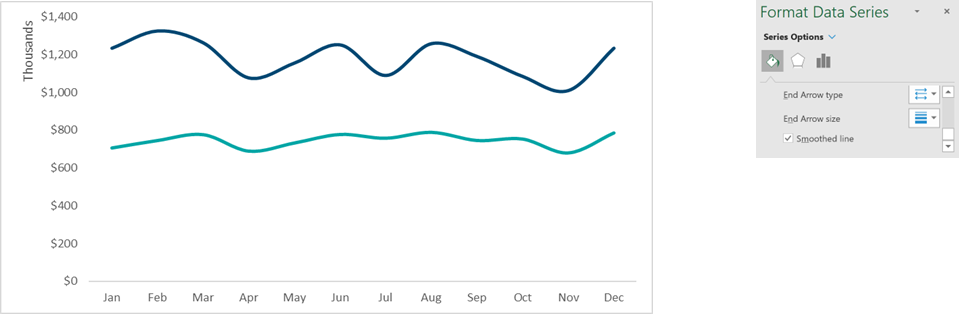
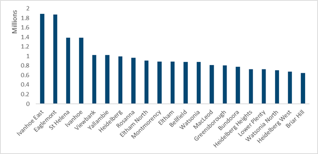
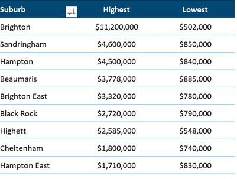
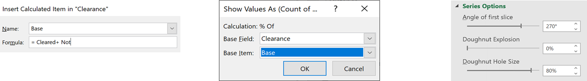
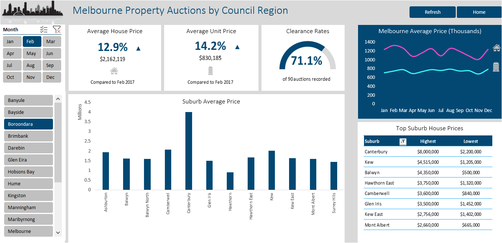

## A stylish interactive dashboard of Melbourne Property Auction Market

From an dataset consisting of 25478 rows and 24 columns, deatiling properties sold at auction for 2017 and 2018 in Melbourne, Australia, I created a series of visualisations and later used them in constructing an interactive dashboard for exploring the Melourne property market. The users can see key metrics for a selected Council Region and Month. 

Click [here](https://github.com/tonCodesData/melbourne-property-auction-report-excel/raw/master/melbourne-property-auctions-dashboard.xlsm) to download the excel file containing data, calculations, and the interactive dashboard.

### The process of making the visualisations: 
1. First to make data easier to work with, I converted the data into a table and named it Sales. 
2. On the first visualisation, I wanted to show the trends for House and Unit sales for each year in the Melbourne Trends sheet.  
    * I created a PivotTable with the data - added **Price** to Values, **Month** to Row, and **Type** to Column.  
    * by changing the calculation to an Average and Number format to Currency, we get the average unit price for each month by housing type. 
    * To visualise I selected the **2D Line PivotChart**, turned off gridlines, legend, Field buttons, and changed the vertical axis units to Thousands. Then I selected a line series and formatted to Smoothed Line checkbox. 

    

3. In the **Suburb Price** sheet, wanted to create a visualisation for Average sales.
    * Made a PivotTable using Sales table. Put Price into Values, change its calculation to Average, suburb into Rows, **Year, Month** and **CouncilArea** into Filters. 
    * Inserted a **2D Column PivotChart** for this PivotTable. Turned of gridlines, legend, chart title and Field Buttons. Changed the vertical axis units to Millions.  
    In the PivotTable, the user can filter by Year, Month(multiple) and CouncilArea to visualise Average Sales for a particular council in a timeframe.

    

4. In the **Top Suburbs** sheet, created a PivotTable showing the highest and lowest Price of each Suburb. 
    * Added price to Values twice and change the calculations to **MAX** and **MIN**.
    * Added filters for **Type** and **CouncilArea**, sorted by Mx price (Desc), and filtered by Value to show only the top 8 by Max Price.  

    

5. Finally, created a gauge chart showing clearance rates.  
    * Clicked on the Sales table, pressed keyboard shortcut ALT + D + P, clicked Next. In the box asking Range, typed Sales and clicked Next. 
    * At this point, when a message pops up to encourage using shared cache, Clicked No. This is because I needed a Calculated Item for my chart. But, as I already used Average calculations, I would not be permitted to do this using shared cache. 
    * Then when asked about where to put the Pivot, select a cell in the **Clearance Rate** sheet.  
    * Added **Clearance** to the Row area and **Price** to the Value area. Chnage calculation of Price to **COUNT**. 
    * Changed calculation to **% of Grand Total** and changed the number format to show one decimal place. 
    * Creating the gauge:
        * In my gauge chart, I wanted to show the two values as half the pie. So I needed another row for the other (invisible) half of the pie. Clicked on the row label, went to **Fields, Items and Sets** and selected **Calculated Item**. Next to Name typed **Base**, in the Formula added **Cleared + NOT**. 

        

        * But that threw out the percentages. To fix it, went back to **Show value as** and selected **% of..**. Set **Base Field** to **Clearance** and **Base Item** to **Base**. 
        * Inserted a Donut Pivot Chart for this Pivot Table. Turned off chart title, legend, and Field Buttons. Changed the angle of first slice and Hole size, set line to No Line and set the fill for the Base segment to No fill. 

    

### Making the dashboard

Next, I created a new worksheet named Dahsboard, added a logo, added shapes as tiles, named them and added a title. The, I pasted the pivotcharts from Melbourne Trends, Suburb Price, and Clearance Rates sheet. 

To include the PivotTable in the **Top Suburbs** sheet, select A3:D11 and copied. Went to the **Dashboard** sheet, clicked in an empty cell, right clicked and selected **Paste Special**, then selected **Paste as Linked Image**. Moved the image onto the **Top Suburbs** tile.

Next I needed the Average Unit Price data. In a new **Calcs** sheet, I used an **AVERAGEIFS** to get an average for a selected Council Region and Month in 2017 and 2018. Then, selected J4 and applied custom number formatting so that positive values show as an up arrow, negative values show as a down arrow and 0 shows nothing. Selected **I4:J7** and copied, pasted as a linked image on Dashoard sheet, then moved onto the Average Unit Price tile and ensured it is Bottom aligned with the image on the Average House Price tile.

Copied cells E10:E11 from the Clearance Rate sheet and pasted as a linked image to finish off the Clearance Rate tile. 

Then added the slicers and provided the final touches to create the following dashboard. 

